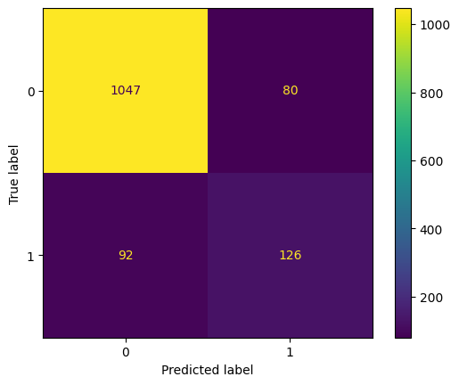

# Breast Cancer Detection Using Convolutional Neural Networks (CNN)

This repository contains a Convolutional Neural Network (CNN) model designed to detect breast cancer from histopathological images. The model is trained to classify images into benign and malignant categories, aiding in the early detection and diagnosis of breast cancer.

Breast cancer is among the most common cancers worldwide. Early and accurate detection is crucial for effective treatment. This project leverages deep learning techniques, specifically CNNs, to analyze histopathological images and classify them as benign or malignant.

## Model Architecture

The CNN model comprises the following layers:

- **Input Layer**: Accepts 50x50 pixel RGB images.
- **Convolutional Layers**: Multiple layers with ReLU activation, Dropout and max-pooling.
- **Fully Connected Layers**: Two dense layers leading to the output.
- **Output Layer**: Sigmoid activation for binary classification.

## Training Configuration

- **Batch Size**: 32
- **Epochs**: 200
- **Optimizer**: Adam
- **Loss Function**: Binary Cross-Entropy

## Performance Metrics

The model's performance was evaluated on training, validation, and test datasets. The following metrics were recorded:

- **Accuracy**: Measures the proportion of correctly classified images.
- **Precision**: Indicates the accuracy of positive predictions.
- **Recall (Sensitivity)**: Reflects the model's ability to identify positive cases.
- **Confusion Matrix**: Provides a detailed breakdown of true positives, true negatives, false positives, and false negatives.
- **Classification Report**: Includes precision, recall, and F1-score for each class.

### Training Metrics

- **Training Accuracy**: 0.9568
- **Training Precision**: 0.8731
- **Training Loss**: 0.1085

### Validation Metrics

- **Validation Accuracy**: 0.8959
- **Validation Precision**: 0.82759
- **Validation Loss**: 0.247

### Test Metrics

- **Test Accuracy**: 0.893
- **Test Precision**: 0.892
- **Test Recall**: 0.893

### Confusion Matrix
[[1047   80]
 [  92  126]]

## License
This project is licensed under the MIT License. Feel free to use and modify the code in your own projects.

